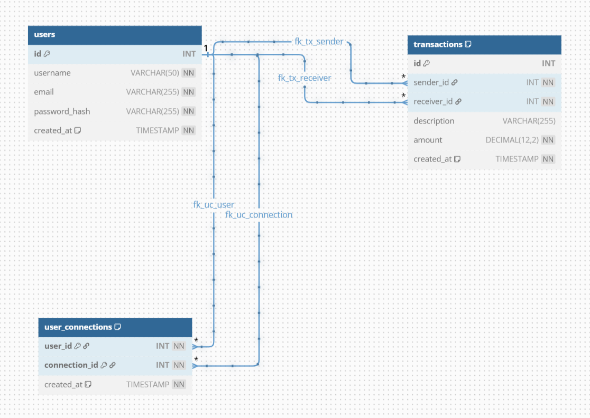

# Pay My Buddy — (Java + Spring Boot, Angular)

Ce repository contient :
- le **modèle physique de données (MPD)**,
- les **scripts SQL** de création de la base,
- l’**application back-end** (Java / Spring Boot) avec couche DAL/référentiel, gestion des transactions et connexion sécurisée à la BDD,
- l’**application front-end** (Angular) basée sur les maquettes et consommant la DAL via l’API.

## Modèle physique de données (MPD)

Disponible dans docs/MPD.png